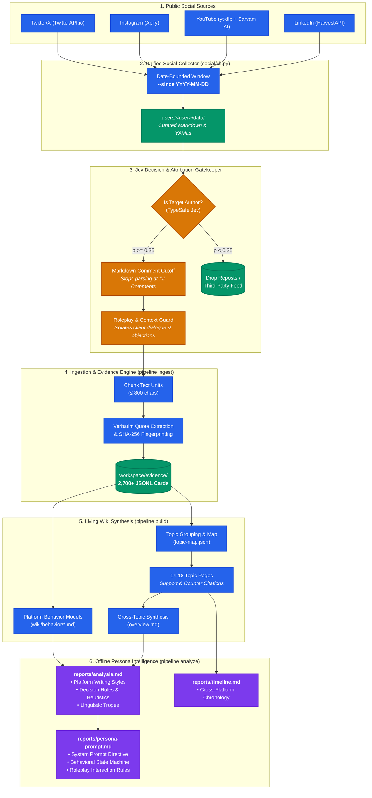

# TrainerTwin Lore

> Source-grounded knowledge ingestion, living wiki synthesis, and behavioral persona engine for TrainerTwin digital human models.

`trainertwin-lore` is an empirical pipeline that extracts raw public evidence from social platforms (LinkedIn, YouTube, Instagram, Twitter/X), validates attribution and context using TypeSafe Jev decision models, constructs an attested living wiki, and compiles structured persona and behavioral analysis reports for real-time digital twins.

---

## Architecture Overview



```text
[ Social Sources ] (LinkedIn, YouTube Transcripts, Instagram, Twitter)
        │
        ▼
[ Social Collector CLI ] (social/cli.py)
   ├── Absolute date-bounded window (--since YYYY-MM-DD)
   └── Saves curated text & manifests into users/<user>/data/
        │
        ▼
[ Jev Authorship & Context Gate ] (TypeSafe Jev Decision Model)
   ├── Authorship Filter: drops third-party feed reposts (p < 0.35)
   └── Comment Cutoff: ignores ## Comments so follower replies never pollute author evidence
        │
        ▼
[ Extraction & Ingest Engine ] (pipeline ingest)
   ├── Chunks documents into <=800-character units with exact locators
   ├── Verbatim quote extraction & SHA-256 fingerprinting
   └── Emits atomic JSONL evidence cards (workspace/evidence/)
        │
        ▼
[ Living Wiki Synthesis ] (pipeline build)
   ├── Dynamic topic grouping (topic-map.json)
   ├── Topic pages with support/counter citations (workspace/wiki/topics/)
   ├── Cross-topic synthesis (workspace/wiki/overview.md)
   └── Platform behavioral modeling (workspace/wiki/behavior/)
        │
        ▼
[ Offline Reporting ] (pipeline analyze)
   ├── analysis.md (Executive persona profile, platform styles, decision rules, tropes)
   ├── timeline.md (Cross-platform publication chronology)
   └── persona-prompt.md (Ready-to-use LLM system prompt spec)
```

---

## Directory Structure

Every user has an isolated, self-contained directory under `users/<slug>/`:

```text
trainertwin-lore/
├── .env.example                   # Environment template
├── pyproject.toml                 # Dependencies (managed via uv)
├── pipeline/                      # Core wiki & behavioral synthesis engine
│   ├── client.py                  # OpenRouter & TypeSafe Jev client
│   ├── core.py                    # Ingest, build, analyze, lint, verify logic
│   ├── prompts.py                 # Structured extraction & synthesis prompts
│   ├── sources.py                 # Markdown, JSON, YAML source unit parser
│   └── tests/                     # 21 offline unit and regression tests
├── social/                        # Unified social media collectors
│   ├── cli.py                     # Date-bounded multi-platform CLI
│   ├── dates.py                   # UTC calendar date parsing & bounds
│   ├── linkedin/                  # HarvestAPI profile & post scraper
│   ├── instagram/                 # Apify Instagram post scraper
│   ├── twitter/                   # TwitterAPI.io tweet & thread extractor
│   └── youtube/                   # yt-dlp & Sarvam AI batch transcription
└── users/
    └── olga/                      # Reference production corpus
        ├── data/                  # Source-of-truth text files
        │   ├── instagram/posts/   # 32 Instagram post markdowns
        │   ├── linkedin/posts/    # 665 LinkedIn post markdowns
        │   ├── twitter/tweets/    # 2 Twitter/X tweet markdowns
        │   └── youtube/           # 108 YouTube transcript YAMLs
        ├── workspace/             # Living wiki, reports, manifests, evidence
        │   ├── wiki/              # Living Markdown wiki & platform behaviors
        │   ├── reports/           # analysis.md, timeline.md, persona-prompt.md
        │   ├── manifest/          # Active source fingerprints
        │   ├── evidence/          # 2,755 source-attested evidence cards (.jsonl)
        │   └── cache/             # Content-hashed LLM synthesis cache
        └── olga-behavior-analysis.md
```

---

## Quick Start

### 1. Installation & Environment Setup
Ensure Python 3.12+ and [`uv`](https://github.com/astral-sh/uv) are installed:

```bash
git clone https://github.com/fl-dev-ops/trainertwin-lore.git
cd trainertwin-lore
uv sync
```

Copy the environment template and populate your API credentials:
```bash
cp .env.example .env
```

| Key | Required For | Provider |
| :--- | :--- | :--- |
| `OPENROUTER_API_KEY` | Ingestion, wiki synthesis, Jev decisions | [OpenRouter](https://openrouter.ai/) |
| `OPENROUTER_MODEL` | Synthesis model (default: `openai/gpt-4o`) | OpenRouter |
| `HARVEST_API_KEY` | LinkedIn profile, post, and comment extraction | [HarvestAPI](https://harvestapi.io/) |
| `TWITTER_API_KEY` | Twitter/X profile and tweet extraction | [TwitterAPI.io](https://twitterapi.io/) |
| `APIFY_API_KEY` | Instagram post and reel extraction | [Apify](https://apify.com/) |
| `SARVAM_API_KEY` | YouTube audio diarized transcription (`saaras:v3`) | [Sarvam AI](https://www.sarvam.ai/) |

---

### 2. Collect Social Sources
Collect public posts from an **absolute inclusive UTC date** to today:

```bash
uv run python -m social --user jane-doe --since 2026-08-01 \
  --linkedin 'https://www.linkedin.com/in/janedoe/' \
  --twitter 'https://x.com/janedoe' \
  --instagram 'https://www.instagram.com/janedoe/' \
  --youtube 'https://www.youtube.com/@janedoe'
```
* Omit any platforms you don't need.
* Downloads YouTube audio and transcribes via Sarvam AI automatically (pass `--no-transcribe` to fetch video metadata only).

---

### 3. Run the Knowledge & Persona Pipeline

#### Step A: Preview Ingestion (Dry Run)
Check which files are discovered and planned chunk calls without making API requests:
```bash
uv run python -m pipeline --user jane-doe ingest --dry-run
```

#### Step B: Extract Evidence Cards
Extract source-grounded evidence with verbatim quotes and unit locators:
```bash
uv run python -m pipeline --user jane-doe ingest --model openai/gpt-4o --max-calls 20
```

#### Step C: Build the Living Wiki & Platform Behaviors
Clusters topics, synthesizes topic pages, generates cross-topic overview, and analyzes platform communication styles:
```bash
uv run python -m pipeline --user jane-doe build --model openai/gpt-4o --max-calls 80
```

#### Step D: Compile Persona Analysis Report
Compiles `reports/analysis.md` offline from the generated wiki without making API calls:
```bash
uv run python -m pipeline --user jane-doe analyze
```

#### Step E: Lint & Integrity Audit
Verifies all 2,700+ evidence cards, source hashes, Markdown links, and synthesis citations:
```bash
uv run python -m pipeline --user jane-doe lint
```

---

## Pi Coding Agent & MCP Server Integration

TrainerTwin Lore natively implements the **Model Context Protocol (MCP)**, allowing any Pi coding agent (or Cursor, Claude Code, Windsurf) to call pipeline tools directly.

### 1. Configure Pi MCP Server
Add the server to your `~/.pi/agent/mcp.json` or project `.pi/mcp.json`:
```json
{
  "mcpServers": {
    "trainertwin-lore": {
      "command": "uv",
      "args": ["run", "trainertwin-mcp"],
      "cwd": "/path/to/trainertwin-lore",
      "env": {
        "OPENROUTER_API_KEY": "your-key-here"
      }
    }
  }
}
```

### 2. Available MCP Tools
- `get_status(user)`: Inspect ingestion counts and stale manifests.
- `lint_workspace(user)`: Run offline integrity audit on evidence cards and citations.
- `read_report(user, report_name)`: Retrieve `analysis.md`, `timeline.md`, or `persona-prompt.md`.
- `get_wiki_topic(user, topic_slug)`: Query specific living wiki topic pages or platform behaviors (`linkedin`, `youtube`, `instagram`, `twitter`).
- `analyze_persona(user)`: Recompile persona reports offline.
- `collect_social(...)`: Collect new trainer social content via CLI scrapers.
- `run_ingest(...)` & `build_wiki(...)`: Ingest sources and build living wikis.

### 3. Pi Skill Integration
Copy the skill definition so Pi discovers the workflow automatically:
```bash
cp -r skills/trainertwin-lore ~/.pi/agent/skills/
```

For full team instructions and a review checklist, see [`docs/TEAM_GUIDE.md`](docs/TEAM_GUIDE.md).

---

## Core Quality & Anti-Hallucination Safeguards

1. **TypeSafe Jev Authorship Gatekeeper**:
   * Scrapes of LinkedIn and X feeds often pull in reposts by other creators.
   * Jev runs a fast, calibrated `noul` decision ($0.04/M tokens) on each post: if probability $< 0.35$, the post is automatically skipped from the author's persona.
2. **Strict Comment-Section Boundary**:
   * Follower comments, unsolicited sales pitches, and community discussions are cut off at `## Comments`.
   * Follower speech is never parsed into author source units.
3. **Roleplay & Objection Separation**:
   * Dialogue lines and simulated client objections (*"I'm already invested in gold"*, *"Can you just send me some options?"*) in coaching videos are strictly typed as `context: "hypothetical"` and `kind: "teaching_move"`.
   * Client words are never attributed as the author's personal beliefs.
4. **Multi-Speaker Transcript Isolation**:
   * In YouTube videos with multiple speakers (trainees, podcast guests), non-host speakers (Speakers 2, 3, 4) are strictly labeled `third_party`.
5. **Sample-Size Awareness**:
   * Platforms with $< 5$ posts (e.g. Olga's 2 tweets) receive a prominent `⚠️ Provisional observation` banner in `analysis.md` to prevent the model from hallucinating a broad content strategy from isolated remarks.

---

## CLI Reference

### Unified Social Collector (`social`)
```text
uv run python -m social [OPTIONS]

Required:
  --user USER           Lowercase user directory slug under users/ (e.g. olga, jane-doe)
  --since YYYY-MM-DD    Inclusive UTC calendar start date; upper bound is today

Platforms (provide at least one):
  --linkedin URL        HTTPS LinkedIn profile URL
  --twitter URL         HTTPS Twitter/X profile or handle
  --instagram URL       HTTPS Instagram profile URL
  --youtube URL         HTTPS YouTube channel or playlist URL

Options:
  --no-transcribe       YouTube: fetch dated video metadata only, skip audio download & Sarvam transcription
```

### Knowledge & Persona Pipeline (`pipeline`)
```text
uv run python -m pipeline [OPTIONS] COMMAND

Options:
  --user USER           User directory name under users/ (default: olga)
  --data PATH           Explicit override for data root (requires --workspace)
  --workspace PATH      Explicit override for workspace root (requires --data)

Commands:
  status                Show ingestion status, source file count, and stale manifests
  ingest                Chunk source text and extract cited JSONL evidence cards
                          --model MODEL         Structured-output capable LLM
                          --max-calls N         Max logical API calls for this run (default: 20)
                          --include GLOB        Limit ingestion to specific paths (repeatable)
                          --dry-run             Inspect planned chunks without API calls
  build                 Incrementally group topics, build wiki pages, and platform behaviors
                          --model MODEL         Structured-output capable LLM
                          --max-calls N         Max logical API calls for this run (default: 20)
  analyze               Compile reports/analysis.md and reports/timeline.md offline
  lint                  Validate evidence integrity, locators, citations, and links offline
  verify                Record human-reviewed external fact verification
```

---

## Testing & Verification

Run the complete test suite (all tests run offline without network or API costs):
```bash
uv run pytest -q pipeline/tests social/tests
```

Run code formatting and style checks:
```bash
uv run ruff check pipeline social
uv run ruff format --check pipeline social
```

Lint a user's knowledge workspace:
```bash
uv run python -m pipeline --user olga lint
```
